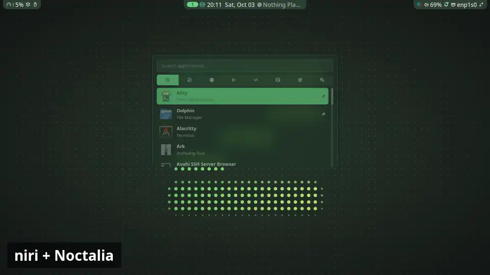

<p align="center">
  <picture>
    <source media="(prefers-color-scheme: dark)" srcset="docs/logo/zexos-logo-dark.svg">
    
  </picture>
</p>

# ZeXOS

ZeXOS is a ready-to-use desktop for CachyOS, Arch Linux and other Arch-based distros, built on the [niri](https://github.com/YaLTeR/niri) scrolling window manager and the [Noctalia](https://noctalia.dev) shell, with Mango, Hyprland and DankMaterialShell as alternatives. One script installs the packages and puts the config files in place, so a fresh install becomes a complete, themed daily desktop.

What you get:

- **niri**, with keybinds, window rules, blur and animations already set up
- **Noctalia v5** as the bar, launcher, notifications and lock screen. It uses a lightly patched build (`packaging/noctalia-zexos`) that attaches the three bar "islands" to the top edge and adds a launcher-only size option.
- **Colours from your wallpaper**: Noctalia generates the theme from the current wallpaper and applies it to GTK, Qt and KDE apps, kitty, fuzzel and btop. Dolphin's folders (Papirus icons) change colour with it. A mostly white wallpaper switches the desktop to light mode with grey-scale colours, so text, icons and the terminal stay readable, and the folders turn white; any other wallpaper switches it back to dark (to choose the mode yourself, create `~/.config/zexos/manual-theme-mode`)
- **Mango** and **Hyprland** as compositors you can pick at the login screen instead of niri, with the same keys (see [Three compositors](#three-compositors))
- **DankMaterialShell** as a second shell you can switch to with `Mod+Shift+D` (see [Two desktop shells](#two-desktop-shells))
- **roller**, a wallpaper picker (`Mod+W`)
- **SDDM** with the Pixie theme; the login screen follows your current wallpaper and shows the ZeXOS logo as its round picture, in your wallpaper's colours; both change with every wallpaper change and shell switch (`packaging/pixie-sddm-zexos/make-avatar.py` draws the six avatars)
- Everyday apps: **kitty** (terminal), **Dolphin** (files), **Gwenview** (images), **Neovim** (text), **VLC** (media)
- No browser is chosen for you: keep the one you have. `Mod+B` opens whichever browser is set as your default. Only if the system has no browser at all (a bare Arch install) is Firefox added
- Your shell stays yours: ZeXOS doesn't change it or add shell config, so bash, zsh or fish all work as before

## Screenshots

<p align="center"><a href="https://zefuros1991.github.io/ZeXOS/?from=readme#1"></a></p>

<p align="center"><b><a href="https://zefuros1991.github.io/ZeXOS/?from=readme#1">Open the gallery</a></b>: every compositor and shell, switching shells, the wallpaper picker, light mode and more, as short clips. Use the arrow keys to move between them; Esc or a click outside the picture brings you back here.</p>

The whole desktop takes its colours from the wallpaper, so every clip looks different.

## Install

ZeXOS is made for Arch-based distros that use Arch's own repos, so it should run on most of them. It has been tested on **CachyOS**, **Arch Linux** and **EndeavourOS**; other Arch-based distros are likely to work too, but haven't been tried yet. It doesn't matter which desktop was picked during the distro's install (KDE, GNOME, niri or none): ZeXOS adds what's missing, and the old desktop stays available in the login screen's session list.

Two Arch-based distros are not supported: Manjaro (it has its own, delayed repos) and Artix (it doesn't use systemd). On those the installer stops early and explains why.

Almost everything comes from Arch's official repos, which all of the supported distros share. Only one thing is CachyOS-only, and on other distros ZeXOS uses a stand-in:

| On CachyOS | Elsewhere |
|---|---|
| Shelly (app store, `Mod+M`) | KDE Discover |

The installer tells them apart by reading `/etc/os-release` (see `scripts/lib-distro.sh`), then runs `scripts/distro/cachyos.sh` or `scripts/distro/arch.sh`. Each step also asks pacman first, so if you added the CachyOS repos to your Arch install, the real CachyOS package is used. To pick by hand, put `ZEXOS_DISTRO=arch` (or `cachyos`) in front of the install command.

```bash
curl -fsSL https://raw.githubusercontent.com/zefuros1991/ZeXOS/main/install.sh -o /tmp/zexos-install.sh; bash /tmp/zexos-install.sh; rm -f /tmp/zexos-install.sh
```

This downloads the installer, runs it, then deletes it. It works the same in fish, bash and zsh. Avoid `curl … | bash`: the installer asks for your sudo password, and piping the script in takes over the input that prompt needs.

If you already cloned the repo to `~/.dotfiles`:

```bash
cd ~/.dotfiles
./install.sh
```

<p align="center"></p>

Run it as your normal user, not root. You need an account that can use `sudo` and a network connection. The installer adds `git` if it's missing, and the bootstrap step installs everything else, including `stow`.

### Fast install or build it yourself

A few ZeXOS apps aren't in the Arch or CachyOS repos: the patched Noctalia, the Pixie login theme, the Bibata pointer, roller, qt6ct-kde and (outside CachyOS) mpvpaper. Right after the password, the installer asks how to get them:

| Choice | What happens | Time |
|---|---|---|
| **1. Ready-made** (default) | Downloads finished packages. It tries the AUR first (`<name>-bin`, only if you have `yay` or `paru`), then the [`prebuilt` release](https://github.com/zefuros1991/ZeXOS/releases/tag/prebuilt) on GitHub. Each download must match the checksum in `packaging/prebuilt.list`. | about a minute |
| **2. Build here** | Builds each one on your computer from the recipes in `packaging/`. | several minutes (Noctalia is the slow one) |

Both give you the same packages. If a ready-made one can't be used (no download, wrong checksum, or `qt6ct-kde` was made for a different Qt than yours), that one is built here instead. To skip the question, put `ZEXOS_PACKAGES=prebuilt` or `ZEXOS_PACKAGES=source` in front of the install command. Your answer becomes the default next time.

The ready-made packages are built in a clean Arch Linux container by `scripts/make-prebuilt.sh`, the same way Arch builds its own ([clean chroot builds](https://wiki.archlinux.org/title/DeveloperWiki:Building_in_a_clean_chroot)).

## What the installer does

`install.sh` first checks which distro you're on (and stops if it's one ZeXOS can't support), then runs four scripts from `scripts/`, in order:

1. **Bootstrap** (`bootstrap.sh`): enables the `multilib` repo if it's off, updates the system, installs the basics (`git`, `curl`, `stow`, `base-devel`, `flatpak`), adds Flathub, and clones this repo to `~/.dotfiles`.
2. **Packages** (`packages.sh`): installs the desktop (niri, Mango, Hyprland, Noctalia and its patched build, DankMaterialShell, roller, fuzzel, kitty), getting ZeXOS's own few packages ready-made or building them, as you chose (see [Fast install or build it yourself](#fast-install-or-build-it-yourself)), the basics a non-niri install may lack (portals, keyring, fonts, sound, network, Bluetooth and power services), the everyday apps, fonts, themes, and SDDM with Pixie. The few distro-specific steps come from `scripts/distro/`. If another login screen is in use (GDM, Plasma Login, ...), it switches to SDDM only after checking SDDM and Pixie are installed and ready. It skips anything already installed. It also adds a pacman hook that rebuilds the patched `qt6ct-kde` (which lets open apps like Dolphin change colour with the wallpaper) after every Qt update, since a new Qt can break it (`journalctl -u zexos-qt6ct-rebuild` shows how it went).
3. **Stow** (`stow.sh`): links every config package under `stow/` into your home folder with [GNU Stow](https://www.gnu.org/software/stow/). Any existing file in the way is first backed up to `backup/stow-<timestamp>/`.
4. **Final touches** (`finaltouches.sh`): copies the wallpapers to `~/Pictures/Wallpapers` and sets up the login-screen wallpaper sync.

Every step keeps a log in `~/.dotfiles`: `install.log`, `bootstrap.log`, `packages.log`, `stow.log` and `finaltouches.log`. If something goes wrong, look there first. Logs are gitignored.

## Main keybinds

| Keys | Action |
|---|---|
| `Mod+Space` | App launcher |
| `Mod+C` | Terminal (kitty) |
| `Mod+B` | Web browser (your default) |
| `Mod+E` | Files (Dolphin) |
| `Mod+W` | Wallpaper picker (roller) |
| `Mod+Shift+W` | Animated wallpaper picker |
| `Mod+M` | Install and update apps (Shelly on CachyOS, Discover elsewhere) |
| `Mod+Ctrl+W` | Random wallpaper |
| `Mod+L` | Lock screen |
| `Mod+Escape` | Power menu |
| `Mod+F1` | Keybind cheatsheet |
| `Mod+Shift+Escape` | niri's hotkey overlay |
| `Mod+Shift+D` | Change desktop shell (Noctalia or DankMaterialShell) |

The full list is in `stow/niri/.config/niri/cfg/keybinds.kdl` (`stow/mango/.config/mango/cfg/keybinds.conf` for Mango, `stow/hyprland/.config/hypr/cfg/keybinds.lua` for Hyprland). These keys do the same thing in both desktop shells and all three compositors.

## Two desktop shells

ZeXOS installs two desktop shells (the top bar, launcher, notifications and lock screen): [Noctalia](https://noctalia.dev) and [DankMaterialShell](https://danklinux.com) (DMS). Noctalia is the default.

Press `Mod+Shift+D`, or click the ⇄ button at the right end of the bar (it is in both shells), and pick one from the menu. The other shell closes and the new one starts right away. Your choice is saved in `~/.config/zexos/shell`, so it is still there after you log out or restart, and every user on the machine has their own.

The switch itself is animated: the screen fades to a dark shade of the old wallpaper's main colour with the new shell's logo large in the middle, that colour slowly turns into the new wallpaper's shade while the shells swap behind it, and then it fades out to the new desktop. You never see a grey or black gap, even with an animated wallpaper. `zexos-motion set switch dip` keeps the colours but drops the logo, and `none` switches with no animation.

How windows open and close, how workspaces move and how fast the shells' panels slide can be picked the same way, and look the same on all three compositors and in both shells: `zexos-motion` lists the choices.

Both use the same keys, because the keybinds call a small helper, `zshell`, instead of a shell directly. `zshell` sends each action (launcher, lock, volume, wallpaper, ...) to whichever shell is running. `zshell --help` lists them, and `zshell switch dms` or `zshell switch noctalia` does the same as the menu from a terminal.

The first time DMS starts it gets a ZeXOS look copied from `stow/dms/.local/share/zexos/dms/`: the same bar items as Noctalia, in the same order, grouped in three like Noctalia's islands: CPU use and updates on the left, DMS's Dank Island in the middle (workspaces, clock, music), and tray, quick settings, notifications, battery and the shell switcher on the right. Each side shares one background, set with DMS's own island settings (no patch). It also gets the same font sizes and the ZeXOS wallpaper. It's a copy, so changes you make in DMS's own settings are kept.

The window you're using gets a frame that fades between two of the wallpaper's colours. The others get a thin, faint line and are dimmed a little, so your eye lands on the right one. That works the same in both shells on niri and Hyprland. Mango can only draw a frame in one colour, so there it's one colour plus the same dimming.

Everything follows the wallpaper in both shells: window borders, kitty, Dolphin and other KDE apps, GTK apps, fuzzel menus, btop, the folder icons and the login screen. A very bright wallpaper switches to light mode. Noctalia does this by itself; for DMS a small watcher, `zexos-dms-sync`, does the parts DMS doesn't (`systemctl --user status zexos-dms-sync.path`). To pick dark or light mode yourself, create `~/.config/zexos/manual-theme-mode`. GTK apps that are already open (like Shelly) keep their old colours until you close and reopen them, because GTK only reads its colours when an app starts; Noctalia's own docs say the same. Open KDE apps, kitty and the rest change by themselves.

What DMS can't do yet, compared to Noctalia: there is no USB drive island (drives still mount from Dolphin) and no "Restart to UEFI" in the power menu.

## Three compositors

The compositor is the part that draws and arranges your windows. ZeXOS sets up three, and you pick one on the login screen (the session menu next to the password box): **niri** (the default), [**Mango**](https://github.com/mangowm/mango) and [**Hyprland**](https://hypr.land).

Mango is set up to feel like niri: windows sit side by side in a row that scrolls sideways, each one half the screen wide at first, with the same gaps, borders, round corners, blur and keys. Both shells work in it, `Mod+Shift+D` switches between them, and window colours follow the wallpaper the same way. Mango's config is in `~/.config/mango`.

Some niri things Mango doesn't have, so in Mango:

- Workspaces are Mango's "tags" 1 to 9. Each screen has its own; `Mod+Tab` goes back to the last one.
- There is no jump to the first or last window (`Mod+Home`/`Mod+End`), and no keys to make a window taller or shorter.
- `Mod+Minus` and `Mod+Equal` step through set widths (a quarter, a third, a half, two thirds, three quarters, full) instead of 10% at a time.
- `Mod+Shift+Escape` shows the same cheat sheet as `Mod+F1` (niri's own hotkey overlay doesn't exist there). Under Noctalia it is a simple searchable list.
- Screenshots use `zexos-screenshot` (grim and slurp) and are saved and copied the same way.

Hyprland is the odd one out on purpose: it **tiles** instead of scrolling. Each new window takes half of the one you're in, side by side on wide windows and one above the other on tall ones, like folding a sheet of paper in half and then in half again. Nothing is ever off screen. `Mod+J` flips a split between side by side and one above the other. Everything else matches niri: the gaps, borders, round corners, blur, keys and both shells, and window colours follow the wallpaper. Hyprland's config is in `~/.config/hypr`, written in Lua (`hyprland.lua` plus the files in `cfg/`).

What is different in Hyprland:

- There is no overview (`Mod+O`) and no jump to the first or last window (`Mod+Home`/`Mod+End`).
- `Mod+Minus`/`Mod+Equal` move the line between two windows left or right by 100 pixels (with Shift, up or down): one window grows and its neighbour shrinks.
- `Mod+Shift+Escape` shows the same cheat sheet as `Mod+F1`.

## Wallpapers

ZeXOS comes with 16 wallpapers of its own, in 5 styles and several colours each, plus 9 animated ones. The installer copies them to `~/Pictures/Wallpapers`, and you start on `zexos-aurora`. The login screen starts with it too.

<a href="https://zefuros1991.github.io/ZeXOS/?from=readme#16"></a>

Press `Mod+W` to pick another one. Put your own pictures in `~/Pictures/Wallpapers` too: Noctalia and roller read from there, and the colour theme follows whichever one is active.

All of them are drawn by `wallpapers/make-wallpapers.py`, with no photos or downloads. To make them in another size, run `python wallpapers/make-wallpapers.py 2560 1440`.

### Animated wallpapers

Nine of the wallpapers also come as 12-second looping videos, covering every style and colour family. They go in `~/Pictures/Wallpapers/Animated`. None is switched on by default, because a looping 4K video puts a small, constant load on the machine.

| Video | What moves |
|---|---|
| `zexos-aurora`, `-ocean`, `-mono` | the three light ribbons ripple, sway and drift |
| `zexos-topo-energy`, `zexos-topo-ember` | energy runs along the contour lines |
| `zexos-mark-ember`, `-light` | the logo's glow breathes and a sheen passes over it; the logo stays still |
| `zexos-bars` | the bars rise and fall gently, like a slow equaliser |
| `zexos-dots-forest` | a wave of light passes through the dots, and some twinkle |

roller shows the pictures and the videos as two groups: `Mod+W` opens it on the pictures, `Mod+Shift+W` on the videos, and `Tab` switches between them. Video cards carry a ▶ badge. Picking a video plays it with Noctalia's Video Wallpaper plugin (ZeXOS ships a copy of it with one extra command, see `ZEXOS.md` in `~/.local/share/noctalia/plugins/mpvpaper`), and its first frame becomes the picture the colour theme follows. Picking a picture stops the video. Under DMS, which can't play videos, you get the first frame as a still.

The `wallpapers/make-*-video.py` scripts draw them (they need `python-numpy`, `python-pillow` and `ffmpeg`).

## Screens

niri detects your screens by itself. To set resolution, scale or position, run `niri msg outputs` and add blocks to `stow/niri/.config/niri/monitors.kdl` (there's a commented example in the file). For Mango, run `mmsg get all-monitors` and add `monitorrule=` lines to `stow/mango/.config/mango/monitors.conf`. For Hyprland, run `hyprctl monitors` and add `hl.monitor` lines to `stow/hyprland/.config/hypr/monitors.lua`.

## Config packages

Every folder under `stow/` is one Stow package, a slice of your home folder that lives in this repo.

| Package | Manages |
|---|---|
| `btop` | `~/.config/btop` |
| `desktop` | default apps (`mimeapps.list`), GTK/Qt/KDE settings, `zshell` (the shell switcher) and its `Mod+Shift+D` menu (`~/.config/quickshell/zexos-switcher`) and `zexos-screenshot` (screenshots on Mango and Hyprland) |
| `dms` | the first-start DankMaterialShell settings (copied, never linked) |
| `fastfetch` | `~/.config/fastfetch` (the system info shown in kitty) |
| `fuzzel` | `~/.config/fuzzel` |
| `htop` | `~/.config/htop` |
| `input` | keyboard and touchpad settings read by Qt/KDE apps |
| `kitty` | `~/.config/kitty` |
| `hyprland` | `~/.config/hypr` |
| `mango` | `~/.config/mango` |
| `niri` | `~/.config/niri` |
| `noctalia` | `~/.config/noctalia` (bar layout, plugins, theming), the SDDM wallpaper-sync script, the light/dark switch and the script that makes the folder icons follow the wallpaper |
| `roller` | `~/.config/roller` and its launcher files |
| `theme` | GTK 3/4, qt5ct, qt6ct and the Noctalia colour files |

To relink a single package after editing it:

```bash
cd ~/.dotfiles
stow -d stow -t "$HOME" <package>       # link
stow -D -d stow -t "$HOME" <package>    # unlink
stow -n -v -d stow -t "$HOME" <package> # dry run: show what would change
```

Some files in `theme` (and `kdeglobals` in `desktop`) are rewritten live by Noctalia whenever the wallpaper changes. That's expected.

## Changes and plans

- [CHANGELOG.md](CHANGELOG.md): what changed in each version, and how the
  version numbers work
- [ROADMAP.md](ROADMAP.md): what's planned next, including NixOS support and
  a ZeXOS installer ISO

## License

[MIT](LICENSE) covers ZeXOS's own files. [CREDITS.md](CREDITS.md) lists the projects ZeXOS is built on, and the few files here that contain their code (those keep their own licenses).
