<p align="center">
  <picture>
    <source media="(prefers-color-scheme: dark)" srcset="docs/logo/zexos-logo-dark.svg">
    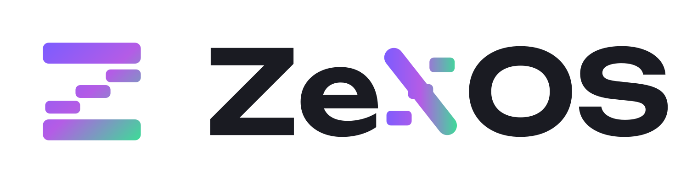
  </picture>
</p>

# ZeXOS

ZeXOS is a ready-to-use desktop for CachyOS, Arch Linux and other Arch-based distros, built on the [niri](https://github.com/YaLTeR/niri) scrolling window manager and the [Noctalia](https://noctalia.dev) shell. One script installs the packages and puts the config files in place, so a fresh install becomes a complete, themed daily desktop.

What you get:

- **niri**, with keybinds, window rules, blur and animations already set up
- **Noctalia v5** as the bar, launcher, notifications and lock screen. It uses a lightly patched build (`packaging/noctalia-zexos`) that attaches the three bar "islands" to the top edge and adds a launcher-only size option.
- **Colours from your wallpaper**: Noctalia generates the theme from the current wallpaper and applies it to GTK, Qt and KDE apps, kitty, fuzzel and btop. Dolphin's folders (Papirus icons) change colour with it. A mostly white wallpaper switches the desktop to light mode with grey-scale colours, so text, icons and the terminal stay readable, and the folders turn white; any other wallpaper switches it back to dark (to choose the mode yourself, create `~/.config/zexos/manual-theme-mode`)
- **roller**, a wallpaper picker (`Mod+W`)
- **SDDM** with the Pixie theme; the login screen follows your current wallpaper and shows the ZeXOS logo as its round picture (`packaging/pixie-sddm-zexos/make-avatar.py` draws it)
- Everyday apps: **kitty** (terminal), **Dolphin** (files), **Gwenview** (images), **Neovim** (text), **VLC** (media)
- No browser is chosen for you: keep the one you have. `Mod+B` opens whichever browser is set as your default. Only if the system has no browser at all (a bare Arch install) is Firefox added
- Your shell stays yours: ZeXOS doesn't change it or add shell config, so bash, zsh or fish all work as before

## Screenshots

The installer waiting for the sudo password:

<p align="center">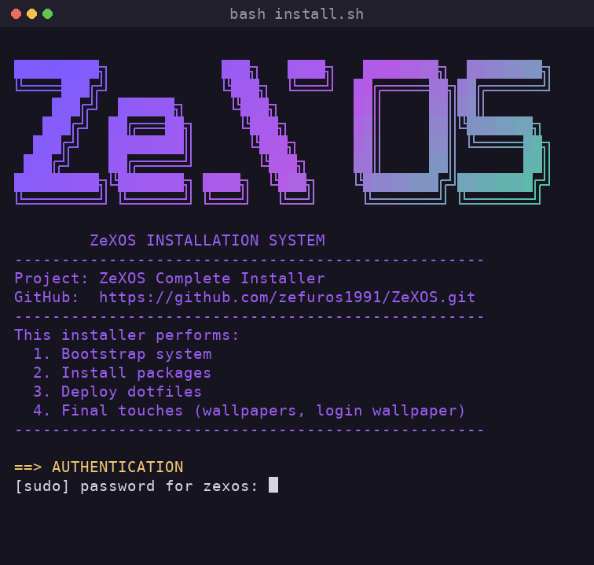</p>

The whole desktop takes its colours from the wallpaper, so every screenshot below looks different.

| CachyOS | Arch Linux | EndeavourOS |
|---|---|---|
| 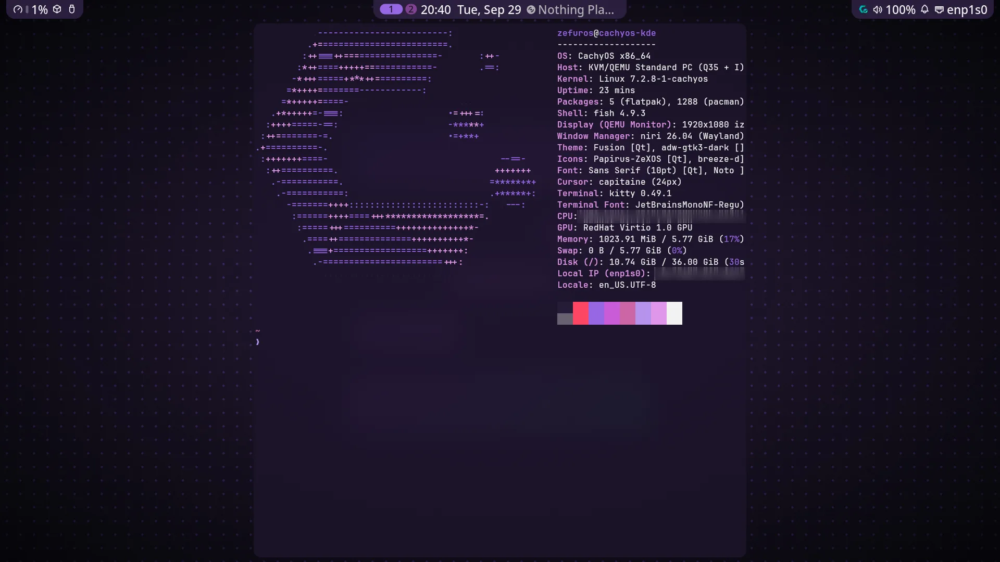 | 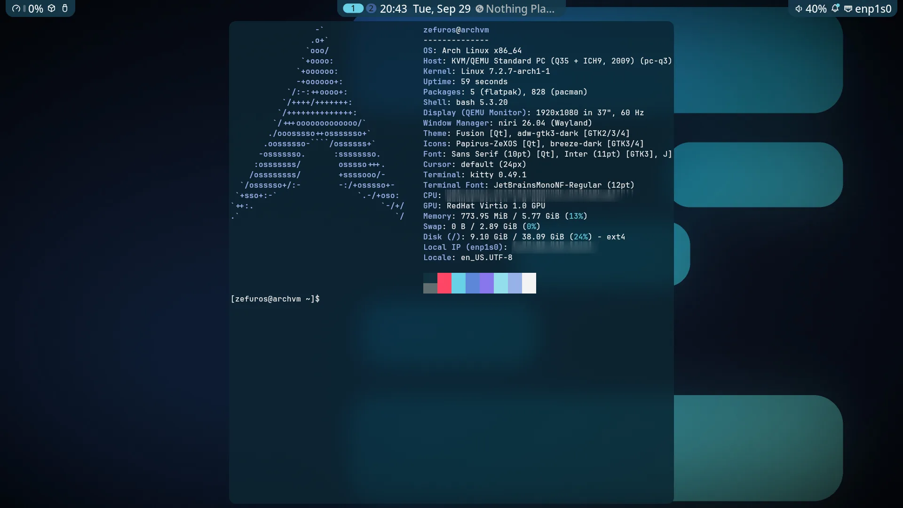 | 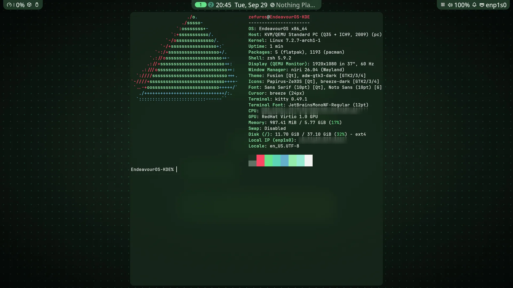 |

| Launcher | Control center | Overview |
|---|---|---|
| 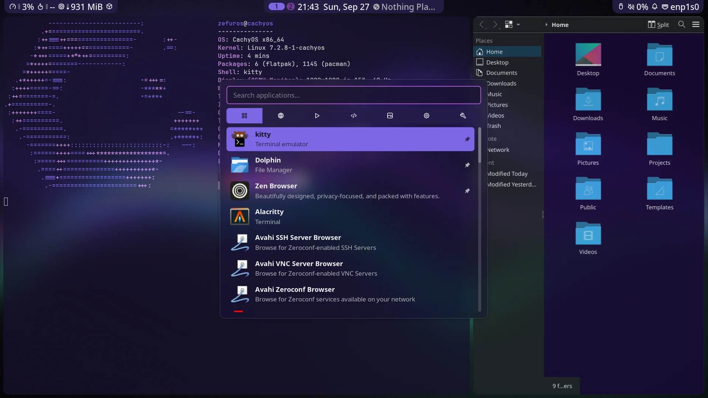 | 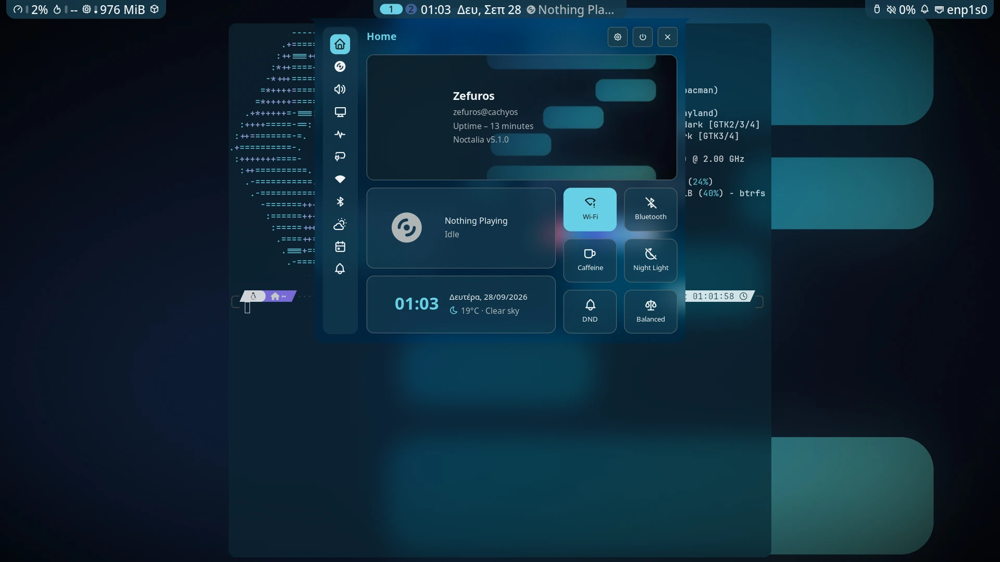 | 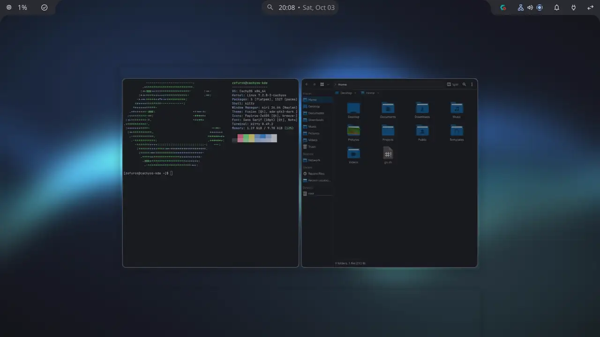 |

| Files | Wallpaper picker | Light mode |
|---|---|---|
| 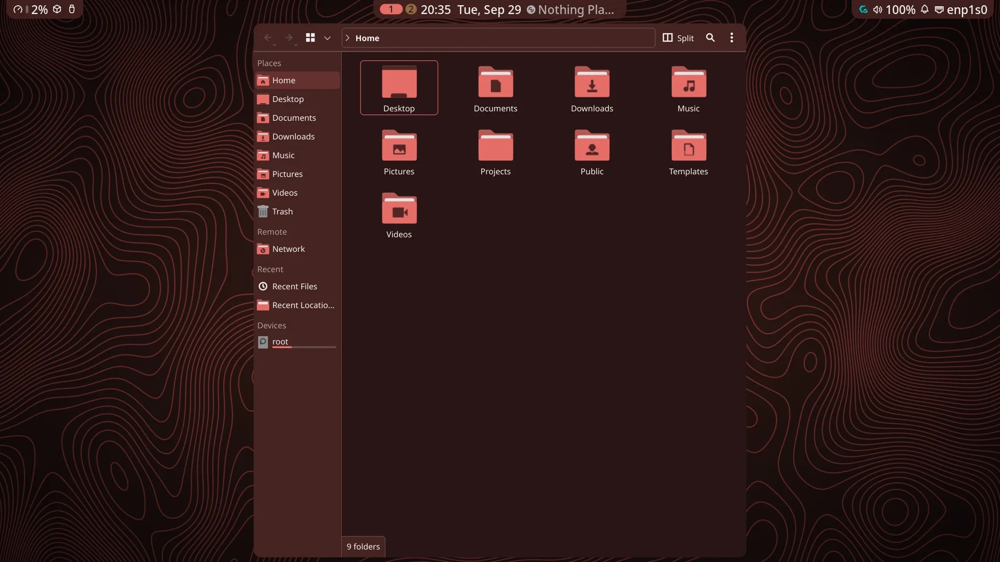 | 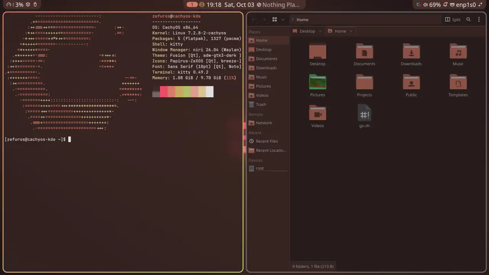 | 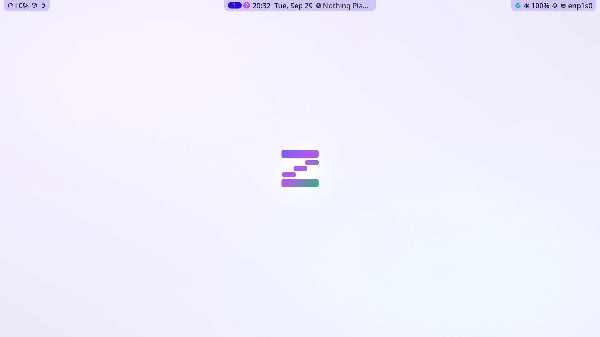 |

## Install

ZeXOS is made for Arch-based distros that use Arch's own repos, so it should run on most of them. It has been tested on **CachyOS**, **Arch Linux** and **EndeavourOS**; other Arch-based distros are likely to work too, but haven't been tried yet. It doesn't matter which desktop was picked during the distro's install (KDE, GNOME, niri or none): ZeXOS adds what's missing, and the old desktop stays available in the login screen's session list.

Two Arch-based distros are not supported: Manjaro (it has its own, delayed repos) and Artix (it doesn't use systemd). On those the installer stops early and explains why.

Almost everything comes from Arch's official repos, which all of the supported distros share. Only one thing is CachyOS-only, and on other distros ZeXOS uses a stand-in:

| On CachyOS | Elsewhere |
|---|---|
| Shelly (app store, `Mod+M`) | KDE Discover |

The installer tells them apart by reading `/etc/os-release` (see `scripts/lib-distro.sh`), then runs `scripts/distro/cachyos.sh` or `scripts/distro/arch.sh`. Each step also asks pacman first, so if you added the CachyOS repos to your Arch install, the real CachyOS package is used. To pick by hand, put `ZEXOS_DISTRO=arch` (or `cachyos`) in front of the install command.

```bash
curl -fsSL https://raw.githubusercontent.com/zefuros1991/ZeXOS/main/install.sh -o /tmp/zexos-install.sh; bash /tmp/zexos-install.sh; rm -f /tmp/zexos-install.sh
```

This downloads the installer, runs it, then deletes it. It works the same in fish, bash and zsh. Avoid `curl … | bash`: the installer asks for your sudo password, and piping the script in takes over the input that prompt needs.

If you already cloned the repo to `~/.dotfiles`:

```bash
cd ~/.dotfiles
./install.sh
```

Run it as your normal user, not root. You need an account that can use `sudo` and a network connection. The installer adds `git` if it's missing, and the bootstrap step installs everything else, including `stow`.

## What the installer does

`install.sh` first checks which distro you're on (and stops if it's one ZeXOS can't support), then runs four scripts from `scripts/`, in order:

1. **Bootstrap** (`bootstrap.sh`): enables the `multilib` repo if it's off, updates the system, installs the basics (`git`, `curl`, `stow`, `base-devel`, `flatpak`), adds Flathub, and clones this repo to `~/.dotfiles`.
2. **Packages** (`packages.sh`): installs the desktop (niri, Noctalia and its patched build, roller, fuzzel, kitty), the basics a non-niri install may lack (portals, keyring, fonts, sound, network, Bluetooth and power services), the everyday apps, fonts, themes, and SDDM with Pixie. The few distro-specific steps come from `scripts/distro/`. If another login screen is in use (GDM, Plasma Login, ...), it switches to SDDM only after checking SDDM and Pixie are installed and ready. It skips anything already installed. It also adds a pacman hook that rebuilds the patched `qt6ct-kde` (which lets open apps like Dolphin change colour with the wallpaper) after every Qt update, since a new Qt can break it (`journalctl -u zexos-qt6ct-rebuild` shows how it went).
3. **Stow** (`stow.sh`): links every config package under `stow/` into your home folder with [GNU Stow](https://www.gnu.org/software/stow/). Any existing file in the way is first backed up to `backup/stow-<timestamp>/`.
4. **Final touches** (`finaltouches.sh`): copies the wallpapers to `~/Pictures/Wallpapers` and sets up the login-screen wallpaper sync.

Every step keeps a log in `~/.dotfiles`: `install.log`, `bootstrap.log`, `packages.log`, `stow.log` and `finaltouches.log`. If something goes wrong, look there first. Logs are gitignored.

## Main keybinds

| Keys | Action |
|---|---|
| `Mod+Space` | App launcher |
| `Mod+C` | Terminal (kitty) |
| `Mod+B` | Web browser (your default) |
| `Mod+E` | Files (Dolphin) |
| `Mod+W` | Wallpaper picker (roller) |
| `Mod+M` | Install and update apps (Shelly on CachyOS, Discover elsewhere) |
| `Mod+Ctrl+W` | Random wallpaper |
| `Mod+L` | Lock screen |
| `Mod+Escape` | Power menu |
| `Mod+F1` | Keybind cheatsheet |
| `Mod+Shift+Escape` | niri's hotkey overlay |

The full list is in `stow/niri/.config/niri/cfg/keybinds.kdl`.

## Wallpapers

ZeXOS comes with 15 wallpapers of its own, in 5 styles and several colours each. The installer copies them to `~/Pictures/Wallpapers`, and you start on `zexos-aurora`. The login screen starts with it too.

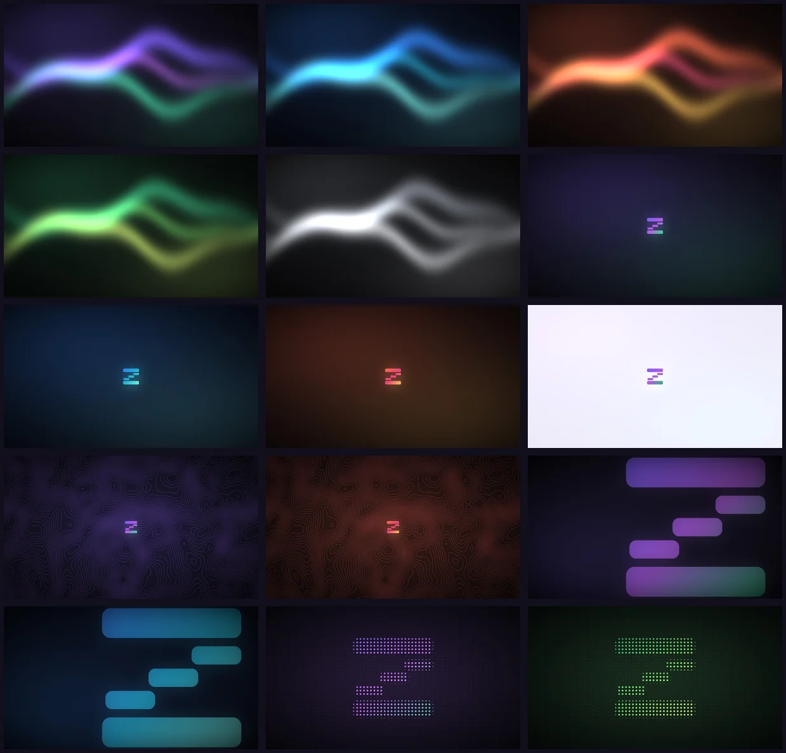

Press `Mod+W` to pick another one. Put your own pictures in `~/Pictures/Wallpapers` too: Noctalia and roller read from there, and the colour theme follows whichever one is active.

All of them are drawn by `wallpapers/make-wallpapers.py`, with no photos or downloads. To make them in another size, run `python wallpapers/make-wallpapers.py 2560 1440`.

## Screens

niri detects your screens by itself. To set resolution, scale or position, run `niri msg outputs` and add blocks to `stow/niri/.config/niri/monitors.kdl` (there's a commented example in the file).

## Config packages

Every folder under `stow/` is one Stow package, a slice of your home folder that lives in this repo.

| Package | Manages |
|---|---|
| `btop` | `~/.config/btop` |
| `desktop` | default apps (`mimeapps.list`), GTK/Qt/KDE settings |
| `fastfetch` | `~/.config/fastfetch` (the system info shown in kitty) |
| `fuzzel` | `~/.config/fuzzel` |
| `htop` | `~/.config/htop` |
| `input` | keyboard and touchpad settings read by Qt/KDE apps |
| `kitty` | `~/.config/kitty` |
| `niri` | `~/.config/niri` |
| `noctalia` | `~/.config/noctalia` (bar layout, plugins, theming), the SDDM wallpaper-sync script, the light/dark switch and the script that makes the folder icons follow the wallpaper |
| `roller` | `~/.config/roller` and its launcher files |
| `theme` | GTK 3/4, qt5ct, qt6ct and the Noctalia colour files |

To relink a single package after editing it:

```bash
cd ~/.dotfiles
stow -d stow -t "$HOME" <package>       # link
stow -D -d stow -t "$HOME" <package>    # unlink
stow -n -v -d stow -t "$HOME" <package> # dry run: show what would change
```

Some files in `theme` (and `kdeglobals` in `desktop`) are rewritten live by Noctalia whenever the wallpaper changes. That's expected.

## License

[MIT](LICENSE) covers ZeXOS's own files. [CREDITS.md](CREDITS.md) lists the projects ZeXOS is built on, and the few files here that contain their code (those keep their own licenses).
