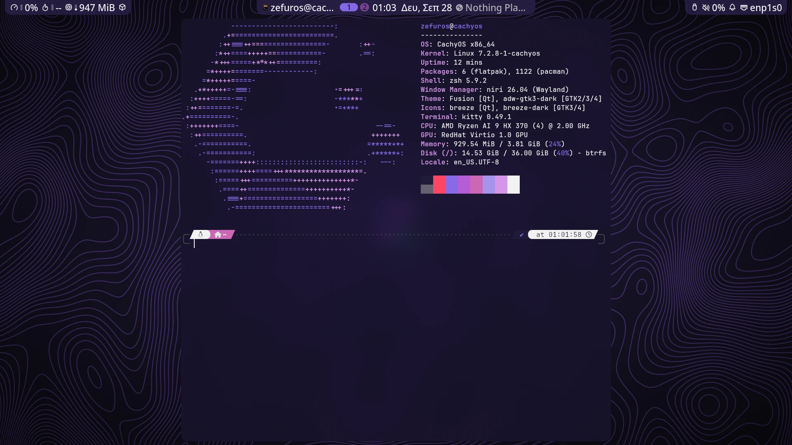

<p align="center">
  <picture>
    <source media="(prefers-color-scheme: dark)" srcset="docs/logo/zexos-logo-dark.svg">
    
  </picture>
</p>

# ZeXOS

ZeXOS is a ready-to-use desktop for CachyOS (and other Arch-based systems), built on the [niri](https://github.com/YaLTeR/niri) scrolling window manager and the [Noctalia](https://noctalia.dev) shell. One script installs the packages and puts the config files in place, so a fresh install becomes a complete, themed daily desktop.

What you get:

- **niri**, with keybinds, window rules, blur and animations already set up
- **Noctalia v5** as the bar, launcher, notifications and lock screen. It uses a lightly patched build (`packaging/noctalia-zexos`) that attaches the three bar "islands" to the top edge and adds a launcher-only size option.
- **Colours from your wallpaper**: Noctalia generates the theme from the current wallpaper and applies it to GTK, Qt, kitty, fuzzel, btop and the Zen browser
- **roller**, a wallpaper picker (`Mod+W`)
- **SDDM** with the Pixie theme; the login screen follows your current wallpaper
- Everyday apps: **kitty** (terminal), **Dolphin** (files), **Gwenview** (images), **Neovim** (text), **Zen** (browser), **VLC** (media)
- **zsh** as the login shell

## Screenshots



| Launcher | Control center | Overview |
|---|---|---|
|  |  |  |

## Install

On a fresh CachyOS install (the niri profile is the smoothest start):

```bash
curl -fsSL https://raw.githubusercontent.com/zefuros1991/ZeXOS/main/install.sh -o /tmp/zexos-install.sh; bash /tmp/zexos-install.sh; rm -f /tmp/zexos-install.sh
```

This downloads the installer, runs it, then deletes it. It works the same in fish, bash and zsh. Avoid `curl … | bash`: the installer asks for your sudo password, and piping the script in takes over the input that prompt needs.

If you already cloned the repo to `~/.dotfiles`:

```bash
cd ~/.dotfiles
./install.sh
```

You need an account that can use `sudo` and a network connection. The bootstrap step installs everything else, including `git` and `stow`.

## What the installer does

`install.sh` runs four scripts from `scripts/`, in order:

1. **Bootstrap** (`bootstrap.sh`): enables the `multilib` repo if it's off, updates the system, installs the basics (`git`, `curl`, `stow`, `base-devel`, `flatpak`), installs the `yay` AUR helper, adds Flathub, and clones this repo to `~/.dotfiles`.
2. **Packages** (`packages.sh`): installs the desktop (niri, Noctalia and its patched build, roller, fuzzel, kitty), the everyday apps, fonts, themes, SDDM with Pixie, and the Zen browser. It skips anything already installed.
3. **Stow** (`stow.sh`): links every config package under `stow/` into your home folder with [GNU Stow](https://www.gnu.org/software/stow/). Any existing file in the way is first backed up to `backup/stow-<timestamp>/`.
4. **Final touches** (`finaltouches.sh`): makes zsh your login shell and sets up the login-screen wallpaper sync.

Each script writes a log next to itself (`bootstrap.log`, `packages.log`, …). Logs are gitignored.

## Main keybinds

| Keys | Action |
|---|---|
| `Mod+Space` | App launcher |
| `Mod+C` | Terminal (kitty) |
| `Mod+B` | Browser (Zen) |
| `Mod+E` | Files (Dolphin) |
| `Mod+W` | Wallpaper picker (roller) |
| `Mod+Ctrl+W` | Random wallpaper |
| `Mod+L` | Lock screen |
| `Mod+Escape` | Power menu |
| `Mod+F1` | Keybind cheatsheet |
| `Mod+Shift+Escape` | niri's hotkey overlay |

The full list is in `stow/niri/.config/niri/cfg/keybinds.kdl`.

## Wallpapers

Put your wallpapers in `~/Pictures/Wallpapers`. Noctalia and roller read from there, and the colour theme follows whichever one is active.

## Screens

niri detects your screens by itself. To set resolution, scale or position, run `niri msg outputs` and add blocks to `stow/niri/.config/niri/monitors.kdl` (there's a commented example in the file).

## Config packages

Every folder under `stow/` is one Stow package, a slice of your home folder that lives in this repo.

| Package | Manages |
|---|---|
| `btop` | `~/.config/btop` |
| `desktop` | default apps (`mimeapps.list`), GTK/Qt/KDE settings |
| `fuzzel` | `~/.config/fuzzel` |
| `htop` | `~/.config/htop` |
| `input` | keyboard and touchpad settings read by Qt/KDE apps |
| `kitty` | `~/.config/kitty` |
| `niri` | `~/.config/niri` |
| `noctalia` | `~/.config/noctalia` (bar layout, plugins, theming) and the SDDM wallpaper-sync script |
| `roller` | `~/.config/roller` and its launcher files |
| `theme` | GTK 3/4, Kvantum, qt5ct and the Noctalia colour files |
| `zsh` | `~/.config/zsh` |

To relink a single package after editing it:

```bash
cd ~/.dotfiles
stow -d stow -t "$HOME" <package>       # link
stow -D -d stow -t "$HOME" <package>    # unlink
stow -n -v -d stow -t "$HOME" <package> # dry run: show what would change
```

Some files in `theme` are rewritten live by Noctalia whenever the wallpaper changes. That's expected.

## Troubleshooting

**Login hangs on a black screen after entering your password.** Check `~/.profile`. SDDM's session script reads it with a strict shell, and a line that sources a missing file (often left behind by an uninstalled tool) kills the session before niri starts. ZeXOS doesn't use `~/.profile`: environment variables go in `~/.config/environment.d/`. Keep `~/.profile` empty, or make sure every file it sources exists.


## License

[MIT](LICENSE)
